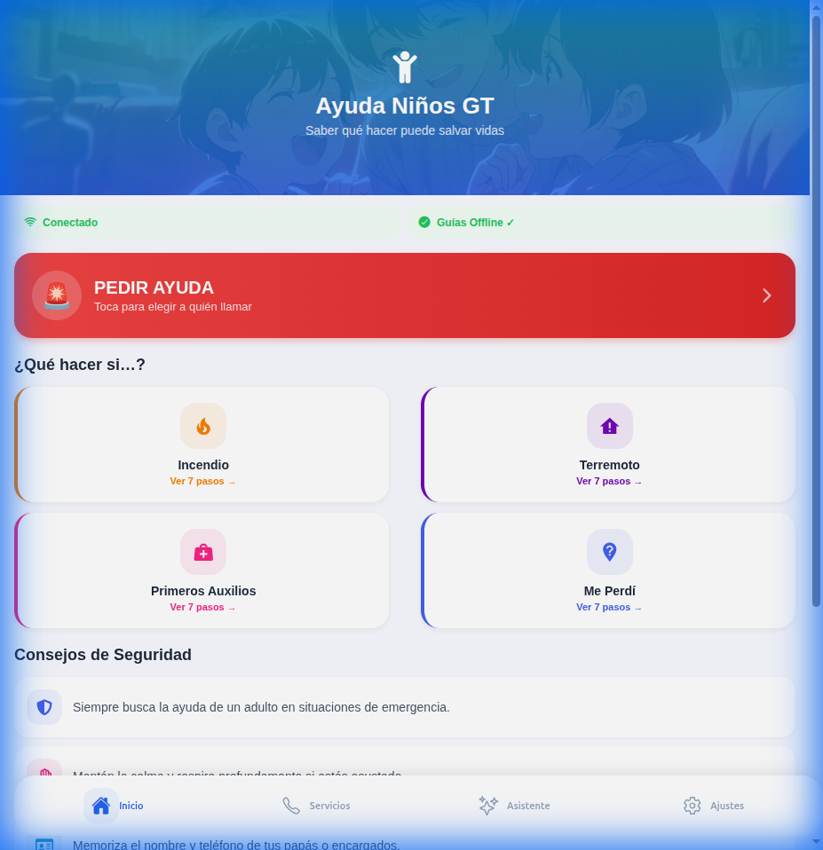
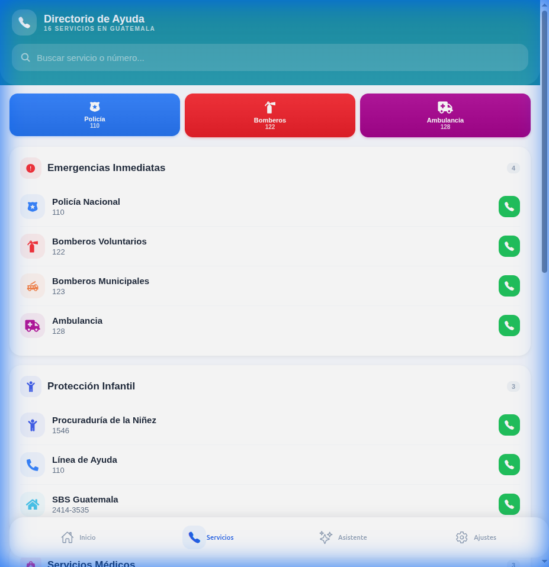
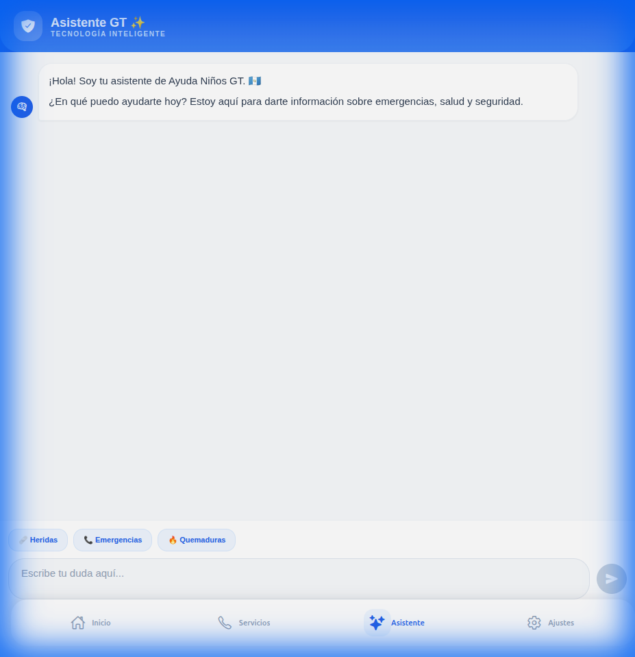
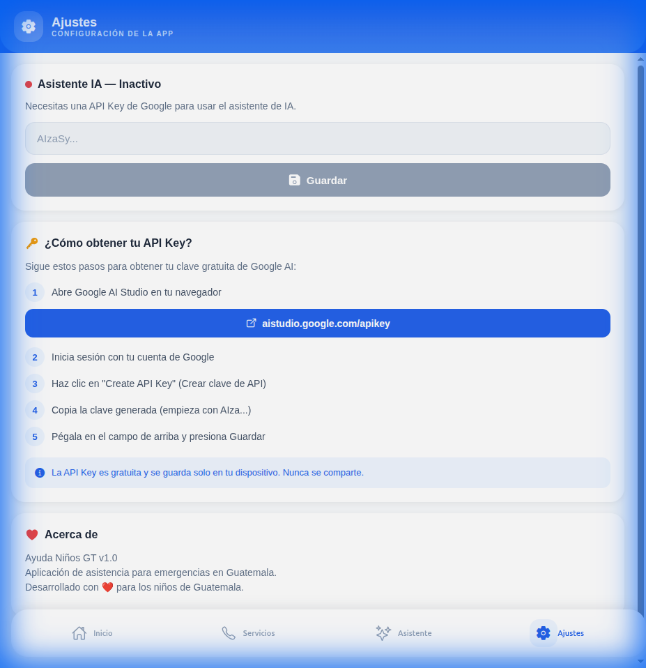

<div align="center">

# 🇬🇹 Ayuda Niños GT

### Aplicación de Asistencia en Emergencias para Niños en Guatemala

> *"Saber qué hacer puede salvar vidas"*

[](https://reactnative.dev/)
[](https://expo.dev/)
[](https://ai.google.dev/)
[](LICENSE)
[]()

---

</div>

## 🌟 ¿Qué es Ayuda Niños GT?

**Ayuda Niños GT** es una aplicación móvil diseñada para empoderar a los niños y jóvenes de Guatemala con las herramientas necesarias para actuar de manera segura durante emergencias. Combina un directorio completo de servicios de emergencia nacionales, guías interactivas paso a paso, y un asistente de inteligencia artificial contextualizado para Guatemala.

En un país donde los desastres naturales (terremotos, erupciones volcánicas, inundaciones) son frecuentes y donde muchos niños pueden encontrarse en situaciones de vulnerabilidad, **tener información accesible y clara puede marcar la diferencia entre la vida y la muerte**.

---

## 📸 Capturas de Pantalla

| Inicio | Servicios | Asistente IA | Ajustes |
|--------|-----------|-------------|---------|
|  |  |  |  |

---

## 🚨 Características Principales

### 🏠 Pantalla de Inicio — *¿Qué hacer?*
- **Botón SOS gigante** para acceso inmediato a servicios de emergencia
- **4 guías interactivas** con pasos detallados:
  - 🔥 Incendio (7 pasos)
  - 🌍 Terremoto (7 pasos)
  - 🩹 Primeros Auxilios (7 pasos)
  - 📍 Me Perdí (7 pasos)
- **Consejos de seguridad** para prevención
- **Modo offline** — las guías funcionan sin internet

### 📞 Directorio de Servicios — *¿A quién llamar?*
- **16+ servicios de emergencia** de Guatemala
- **Buscador en tiempo real** por nombre o número
- **Llamada directa** con un toque
- Categorías: Emergencias, Protección Infantil, Servicios Médicos, Seguridad, Líneas de Apoyo

### ✨ Asistente Inteligente (Gemini AI)
- **Chat contextualizado** exclusivamente para Guatemala
- **Texto a Voz** — escucha las respuestas en voz alta
- **Traducción a K'iche'** — idioma maya de Guatemala
- **Generación de imágenes** educativas para niños
- **Sugerencias rápidas** para emergencias comunes

### ⚙️ Configuración Personal
- **Guarda tu propia API Key** de Google AI (gratuita)
- **Tutorial paso a paso** para obtener una clave
- Almacenamiento seguro solo en el dispositivo

---

## 💡 Impacto Social

### El Problema
- Guatemala es uno de los países más vulnerables a desastres naturales en Latinoamérica
- **51% de la población** es menor de 25 años
- Muchos niños en áreas rurales no tienen acceso a educación sobre emergencias
- La barrera del idioma (español vs. idiomas mayas) limita el acceso a información

### Nuestra Solución
| Problema | Solución |
|----------|----------|
| Niños no saben qué hacer en emergencias | ✅ Guías paso a paso con 7 acciones claras |
| No conocen los números de emergencia | ✅ Directorio con llamada directa |
| No tienen acceso a internet | ✅ Modo offline para guías |
| Barrera de idioma | ✅ Traducción automática a K'iche' |
| Información difícil de entender | ✅ IA que explica de forma simple |

### Objetivos de Desarrollo Sostenible (ODS)
- 🎯 **ODS 3** — Salud y Bienestar
- 🎯 **ODS 4** — Educación de Calidad
- 🎯 **ODS 11** — Ciudades Seguras
- 🎯 **ODS 16** — Paz, Justicia e Instituciones

---

## 🛠️ Tecnologías

| Tecnología | Uso |
|------------|-----|
| **React Native** | Framework de desarrollo móvil |
| **Expo SDK 52** | Herramientas de desarrollo y build |
| **TypeScript** | Tipado estático para calidad de código |
| **Gemini 2.5 Flash** | Chat inteligente contextualizado |
| **Gemini TTS** | Texto a voz en español |
| **Imagen 4.0** | Generación de imágenes educativas |
| **AsyncStorage** | Almacenamiento local seguro |
| **expo-av** | Reproducción de audio TTS |
| **expo-router** | Navegación basada en archivos |

---

## 🚀 Instalación

### Requisitos Previos
- [Node.js](https://nodejs.org/) (v18+)
- [npm](https://www.npmjs.com/) o [yarn](https://yarnpkg.com/)
- [Expo CLI](https://docs.expo.dev/get-started/installation/)

### Pasos

```bash
# 1. Clonar el repositorio
git clone https://github.com/EduGuate/ayudagt.git
cd ayudagt

# 2. Instalar dependencias
npm install

# 3. Iniciar la aplicación
npm run dev
```

### Configurar el Asistente IA (Opcional)

1. Abre [aistudio.google.com/apikey](https://aistudio.google.com/apikey)
2. Inicia sesión con tu cuenta de Google
3. Haz clic en **"Create API Key"**
4. Copia la clave generada
5. En la app, ve a **Ajustes** → pega tu clave → **Guardar**

> 💡 La API Key es **gratuita** y se almacena únicamente en tu dispositivo.

---

## 🤝 Contribuir

¡Las contribuciones son bienvenidas! Si quieres ayudar a mejorar esta herramienta para los niños de Guatemala:

1. Haz fork del proyecto
2. Crea una rama para tu feature (`git checkout -b feature/nueva-funcionalidad`)
3. Haz commit de tus cambios (`git commit -m 'Agrega nueva funcionalidad'`)
4. Push a la rama (`git push origin feature/nueva-funcionalidad`)
5. Abre un Pull Request

### Ideas para contribuir
- 🌐 Agregar más idiomas mayas (Q'eqchi', Kaqchikel, Mam)
- 📍 Integración de GPS para localización
- 👨‍👩‍👧 Contactos de confianza personalizados
- 🔔 Alertas de desastres naturales en tiempo real
- ♿ Mejoras de accesibilidad

---

## 📄 Licencia

Este proyecto está bajo la Licencia MIT — consulta el archivo [LICENSE](LICENSE) para más detalles.

---

<div align="center">

Desarrollado con ❤️ para los niños de Guatemala 🇬🇹

**Porque todo niño merece saber cómo protegerse.**

</div>
